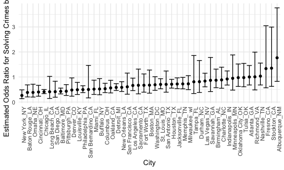
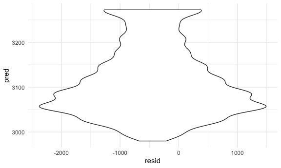
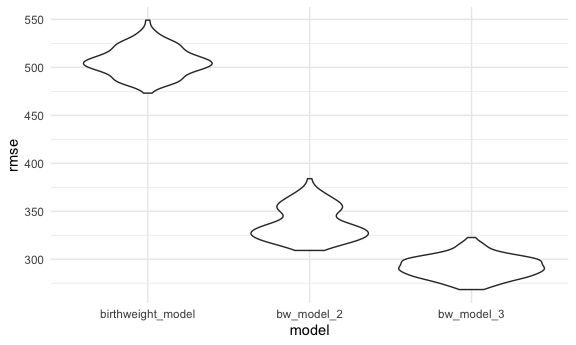

p8105_hw6_glj2117
================
2022-12-03

## Problem 1- Central Park Weather Data

The boostrap is helpful when you’d like to perform inference for a
parameter / value / summary that doesn’t have an easy-to-write-down
distribution in the usual repeated sampling framework. We’ll focus on a
simple linear regression with tmax as the response and tmin as the
predictor, and are interested in the distribution of two quantities
estimated from these data:

r̂ 2 log(β̂ 0∗β̂ 1)

Use 5000 bootstrap samples and, for each bootstrap sample, produce
estimates of these two quantities. Plot the distribution of your
estimates, and describe these in words. Using the 5000 bootstrap
estimates, identify the 2.5% and 97.5% quantiles to provide a 95%
confidence interval for r̂ 2 and log(β̂ 0∗β̂ 1). Note: broom::glance() is
helpful for extracting r̂ 2 from a fitted regression, and broom::tidy()
(with some additional wrangling) should help in computing log(β̂ 0∗β̂ 1).

``` r
weather_df = 
  rnoaa::meteo_pull_monitors(
    c("USW00094728"),
    var = c("PRCP", "TMIN", "TMAX"), 
    date_min = "2017-01-01",
    date_max = "2017-12-31") %>%
  mutate(
    name = recode(id, USW00094728 = "CentralPark_NY"),
    tmin = tmin / 10,
    tmax = tmax / 10) %>%
  select(name, id, everything())
```

    ## Registered S3 method overwritten by 'hoardr':
    ##   method           from
    ##   print.cache_info httr

    ## using cached file: ~/Library/Caches/R/noaa_ghcnd/USW00094728.dly

    ## date created (size, mb): 2022-03-22 14:09:21 (7.641)

    ## file min/max dates: 1869-01-01 / 2022-03-31

## Problem 2- Homicide Data

Create a city_state variable (e.g. “Baltimore, MD”), and a binary
variable indicating whether the homicide is solved. Omit cities Dallas,
TX; Phoenix, AZ; and Kansas City, MO – these don’t report victim race.
Also omit Tulsa, AL – this is a data entry mistake. For this problem,
limit your analysis those for whom victim_race is white or black. Be
sure that victim_age is numeric.

``` r
homicide_data = read_csv("./data/homicide-data.csv", show_col_types = FALSE) %>%
  janitor::clean_names() %>% 
  unite(city_state, city, state) %>% 
  mutate(solved = if_else(disposition == "Closed without arrest", 0, 1)) %>%
  mutate(solved = if_else(disposition == "Open/No arrest", 0, solved)) %>% 
 filter(!(city_state %in% c("Dallas_TX", "Phoenix_AZ", "Kansas City_MO", "Tulsa_AL"))) %>% 
  filter(victim_race %in% c("White", "Black")) %>% 
  mutate(victim_age = as.numeric(victim_age))
```

    ## Warning in mask$eval_all_mutate(quo): NAs introduced by coercion

For the city of Baltimore, MD, use the glm function to fit a logistic
regression with resolved vs unresolved as the outcome and victim age,
sex and race as predictors. Save the output of glm as an R object; apply
the broom::tidy to this object; and obtain the estimate and confidence
interval of the adjusted odds ratio for solving homicides comparing male
victims to female victims keeping all other variables fixed.

``` r
Baltimore_df =
  homicide_data %>% 
  filter(city_state == "Baltimore_MD")
  
balt_fit_logistic = 
  Baltimore_df %>% 
  glm(solved ~ victim_age + victim_sex + victim_race, data = ., family = binomial()) %>% 
   broom::tidy(conf.int = TRUE) %>% 
  mutate(OR = exp(estimate), conf.low = exp(conf.low), conf.high = exp(conf.high)) %>%
  select(term, log_OR = estimate, OR, p.value, conf.low, conf.high) 

balt_fit_logistic
```

    ## # A tibble: 4 × 6
    ##   term               log_OR    OR  p.value conf.low conf.high
    ##   <chr>               <dbl> <dbl>    <dbl>    <dbl>     <dbl>
    ## 1 (Intercept)       0.310   1.36  7.04e- 2    0.976     1.91 
    ## 2 victim_age       -0.00673 0.993 4.30e- 2    0.987     1.00 
    ## 3 victim_sexMale   -0.854   0.426 6.26e-10    0.324     0.558
    ## 4 victim_raceWhite  0.842   2.32  1.45e- 6    1.65      3.28

Now run glm for each of the cities in your dataset, and extract the
adjusted odds ratio (and CI) for solving homicides comparing male
victims to female victims. Do this within a “tidy” pipeline, making use
of purrr::map, list columns, and unnest as necessary to create a
dataframe with estimated ORs and CIs for each city.

``` r
city_glm =
  homicide_data %>%
  nest(data = -city_state) %>% 
  mutate(
    models = map(data, ~glm(solved ~ victim_age + victim_sex + victim_race, data = ., family = binomial())),
    results = map(models, broom::tidy, conf.int = TRUE)) %>% 
  select(city_state, results) %>% 
  unnest(cols = c(results)) %>% 
  mutate(OR = exp(estimate), conf.low = exp(conf.low), conf.high = exp(conf.high)) %>% 
  select(city_state, OR, conf.low, conf.high, term) %>% 
  filter(term == "victim_sexMale")
```

    ## Warning: glm.fit: fitted probabilities numerically 0 or 1 occurred

    ## Warning: glm.fit: fitted probabilities numerically 0 or 1 occurred

    ## Warning: glm.fit: fitted probabilities numerically 0 or 1 occurred

    ## Warning: glm.fit: fitted probabilities numerically 0 or 1 occurred

    ## Warning: glm.fit: fitted probabilities numerically 0 or 1 occurred

    ## Warning: glm.fit: fitted probabilities numerically 0 or 1 occurred

    ## Warning: glm.fit: fitted probabilities numerically 0 or 1 occurred

    ## Warning: glm.fit: fitted probabilities numerically 0 or 1 occurred

    ## Warning: glm.fit: fitted probabilities numerically 0 or 1 occurred

    ## Warning: glm.fit: fitted probabilities numerically 0 or 1 occurred

    ## Warning: glm.fit: fitted probabilities numerically 0 or 1 occurred

    ## Warning: glm.fit: fitted probabilities numerically 0 or 1 occurred

    ## Warning: glm.fit: fitted probabilities numerically 0 or 1 occurred

    ## Warning: glm.fit: fitted probabilities numerically 0 or 1 occurred

    ## Warning: glm.fit: fitted probabilities numerically 0 or 1 occurred

    ## Warning: glm.fit: fitted probabilities numerically 0 or 1 occurred

    ## Warning: glm.fit: fitted probabilities numerically 0 or 1 occurred

    ## Warning: glm.fit: fitted probabilities numerically 0 or 1 occurred

    ## Warning: glm.fit: fitted probabilities numerically 0 or 1 occurred

    ## Warning: glm.fit: fitted probabilities numerically 0 or 1 occurred

    ## Warning: glm.fit: fitted probabilities numerically 0 or 1 occurred

    ## Warning: glm.fit: fitted probabilities numerically 0 or 1 occurred

    ## Warning: glm.fit: fitted probabilities numerically 0 or 1 occurred

    ## Warning: glm.fit: fitted probabilities numerically 0 or 1 occurred

    ## Warning: glm.fit: fitted probabilities numerically 0 or 1 occurred

    ## Warning: glm.fit: fitted probabilities numerically 0 or 1 occurred

    ## Warning: glm.fit: fitted probabilities numerically 0 or 1 occurred

    ## Warning: glm.fit: fitted probabilities numerically 0 or 1 occurred

    ## Warning: glm.fit: fitted probabilities numerically 0 or 1 occurred

    ## Warning: glm.fit: fitted probabilities numerically 0 or 1 occurred

    ## Warning: glm.fit: fitted probabilities numerically 0 or 1 occurred

    ## Warning: glm.fit: fitted probabilities numerically 0 or 1 occurred

    ## Warning: glm.fit: fitted probabilities numerically 0 or 1 occurred

    ## Warning: glm.fit: fitted probabilities numerically 0 or 1 occurred

    ## Warning: glm.fit: fitted probabilities numerically 0 or 1 occurred

    ## Warning: glm.fit: fitted probabilities numerically 0 or 1 occurred

    ## Warning: glm.fit: fitted probabilities numerically 0 or 1 occurred

    ## Warning: glm.fit: fitted probabilities numerically 0 or 1 occurred

    ## Warning: glm.fit: fitted probabilities numerically 0 or 1 occurred

    ## Warning: glm.fit: fitted probabilities numerically 0 or 1 occurred

    ## Warning: glm.fit: fitted probabilities numerically 0 or 1 occurred

    ## Warning: glm.fit: fitted probabilities numerically 0 or 1 occurred

    ## Warning: glm.fit: fitted probabilities numerically 0 or 1 occurred

Create a plot that shows the estimated ORs and CIs for each city.
Organize cities according to estimated OR, and comment on the plot.

``` r
city_glm %>% 
  ggplot(aes(x = fct_reorder(city_state, OR), y = OR)) +
  geom_point() +
  geom_errorbar(aes(ymin = conf.low, ymax = conf.high)) +
  theme(axis.text.x = element_text(angle = 90, hjust = 1)) +
  xlab("City") +
  ylab("Estimated Odds Ratio for Solving Crimes by Gender")
```


This plot shows the estimated odds ratios for solving crimes involving
male victims (vs. female victims), with the 95% CIs as error bars. The
city with the highest odds ratio is Albuquerque, NM, while the lowest
odds ratio is in NYC. However, it seems that as odds ratios increase, so
do confidence intervals (although not for all cities). NYC has a much
smaller confidence interval range than Albuqueque (which has an
extremely wide CI range) likely due to the increased sample size in NYC.
It seems that, in general, the cities with higher odds ratios for
solving crimes involving male victims are smaller, less urban cities,
while the larger urban areas such as NYC, Chicago, Philadelphis, etc..
have lower odds ratios.

## Problem 3- Birthweight dataset

Load and clean the data for regression analysis (i.e. convert numeric to
factor where appropriate, check for missing data, etc.).

``` r
birthweight_data = read_csv("./data/birthweight.csv") %>%
  janitor::clean_names() %>% 
  mutate(babysex = as.factor(babysex),
         malform = as.factor(malform),
         mrace = as.factor(mrace),
         frace = as.factor(frace)
         )
```

    ## Rows: 4342 Columns: 20
    ## ── Column specification ────────────────────────────────────────────────────────
    ## Delimiter: ","
    ## dbl (20): babysex, bhead, blength, bwt, delwt, fincome, frace, gaweeks, malf...
    ## 
    ## ℹ Use `spec()` to retrieve the full column specification for this data.
    ## ℹ Specify the column types or set `show_col_types = FALSE` to quiet this message.

Propose a regression model for birthweight. This model may be based on a
hypothesized structure for the factors that underly birthweight, on a
data-driven model-building process, or a combination of the two.
Describe your modeling process and show a plot of model residuals
against fitted values – use add_predictions and add_residuals in making
this plot.

    Family income as a predictor for birthweight. I chose family income as a predictor because there is some evidence that low birthweight is a good indicator of further health disparities (both racial and socioeconomic).


    ```r
    birthweight_model = lm(bwt ~ fincome, data = birthweight_data) 

    birthweight_model %>% 
      broom::tidy()

    ## # A tibble: 2 × 5
    ##   term        estimate std.error statistic  p.value
    ##   <chr>          <dbl>     <dbl>     <dbl>    <dbl>
    ## 1 (Intercept)  2980.      15.1       197.  0       
    ## 2 fincome         3.05     0.296      10.3 1.26e-24

``` r
modelr::add_residuals(birthweight_data, birthweight_model)  
```

    ## # A tibble: 4,342 × 21
    ##    babysex bhead blength   bwt delwt fincome frace gaweeks malform menarche
    ##    <fct>   <dbl>   <dbl> <dbl> <dbl>   <dbl> <fct>   <dbl> <fct>      <dbl>
    ##  1 2          34      51  3629   177      35 1        39.9 0             13
    ##  2 1          34      48  3062   156      65 2        25.9 0             14
    ##  3 2          36      50  3345   148      85 1        39.9 0             12
    ##  4 1          34      52  3062   157      55 1        40   0             14
    ##  5 2          34      52  3374   156       5 1        41.6 0             13
    ##  6 1          33      52  3374   129      55 1        40.7 0             12
    ##  7 2          33      46  2523   126      96 2        40.3 0             14
    ##  8 2          33      49  2778   140       5 1        37.4 0             12
    ##  9 1          36      52  3515   146      85 1        40.3 0             11
    ## 10 1          33      50  3459   169      75 2        40.7 0             12
    ## # … with 4,332 more rows, and 11 more variables: mheight <dbl>, momage <dbl>,
    ## #   mrace <fct>, parity <dbl>, pnumlbw <dbl>, pnumsga <dbl>, ppbmi <dbl>,
    ## #   ppwt <dbl>, smoken <dbl>, wtgain <dbl>, resid <dbl>

``` r
modelr::add_predictions(birthweight_data, birthweight_model)
```

    ## # A tibble: 4,342 × 21
    ##    babysex bhead blength   bwt delwt fincome frace gaweeks malform menarche
    ##    <fct>   <dbl>   <dbl> <dbl> <dbl>   <dbl> <fct>   <dbl> <fct>      <dbl>
    ##  1 2          34      51  3629   177      35 1        39.9 0             13
    ##  2 1          34      48  3062   156      65 2        25.9 0             14
    ##  3 2          36      50  3345   148      85 1        39.9 0             12
    ##  4 1          34      52  3062   157      55 1        40   0             14
    ##  5 2          34      52  3374   156       5 1        41.6 0             13
    ##  6 1          33      52  3374   129      55 1        40.7 0             12
    ##  7 2          33      46  2523   126      96 2        40.3 0             14
    ##  8 2          33      49  2778   140       5 1        37.4 0             12
    ##  9 1          36      52  3515   146      85 1        40.3 0             11
    ## 10 1          33      50  3459   169      75 2        40.7 0             12
    ## # … with 4,332 more rows, and 11 more variables: mheight <dbl>, momage <dbl>,
    ## #   mrace <fct>, parity <dbl>, pnumlbw <dbl>, pnumsga <dbl>, ppbmi <dbl>,
    ## #   ppwt <dbl>, smoken <dbl>, wtgain <dbl>, pred <dbl>

``` r
birthweight_data %>% 
  modelr::add_residuals(birthweight_model) %>% 
  modelr::add_predictions(birthweight_model) %>% 
  ggplot(aes(x = resid, y = pred)) + geom_violin()
```



Compare your model to two others:

One using length at birth and gestational age as predictors (main
effects only) One using head circumference, length, sex, and all
interactions (including the three-way interaction) between these Make
this comparison in terms of the cross-validated prediction error; use
crossv_mc and functions in purrr as appropriate.

``` r
bw_model_2 = lm(bwt ~ blength + gaweeks, data = birthweight_data) %>% 
  broom::tidy()


bw_model_3 = lm(bwt ~ bhead * blength * babysex, data = birthweight_data) %>% 
  broom::tidy()


cv_df = 
  crossv_mc(birthweight_data, 100) 
  
cv_df = 
  cv_df %>% 
  mutate(
    birthweight_model  = map(train, ~lm(bwt ~ fincome, data = .x)),
    bw_model_2 = map(train, ~lm(bwt ~ blength + gaweeks, data = .x)),
    bw_model_3 = map(train, ~lm(bwt ~bhead * blength * babysex, data = .x))) %>% 
  mutate(
    rmse_birthweight_model = map2_dbl(birthweight_model, test, ~rmse(model = .x, data = .y)),
    rmse_bw_model_2 = map2_dbl(bw_model_2, test, ~rmse(model = .x, data = .y)),
    rmse_bw_model_3 = map2_dbl(bw_model_3, test, ~rmse(model = .x, data = .y)))
    
cv_df %>% 
  select(starts_with("rmse")) %>% 
  pivot_longer(
    everything(),
    names_to = "model", 
    values_to = "rmse",
    names_prefix = "rmse_") %>% 
  mutate(model = fct_inorder(model)) %>% 
  ggplot(aes(x = model, y = rmse)) + geom_violin()
```


Given the RMSEs, bw_model_3 (the model which includes all interaction
terms and the three-way interaction) is the “winner,” with the highest
accuracy. By comparison, my linear model has the highest RMSE and is
much less accurate than the other two models- due to the fact that my
model only included one predictor.
